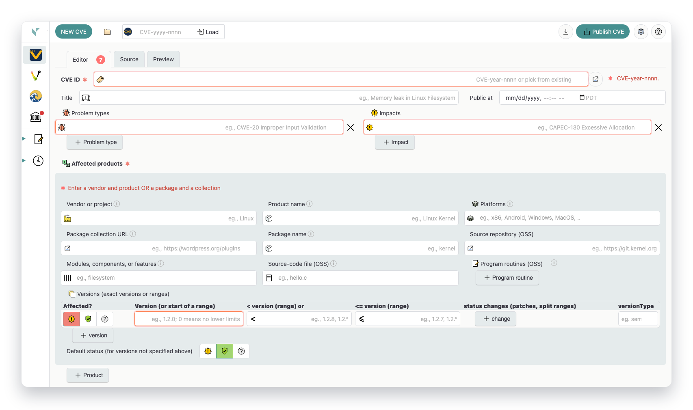
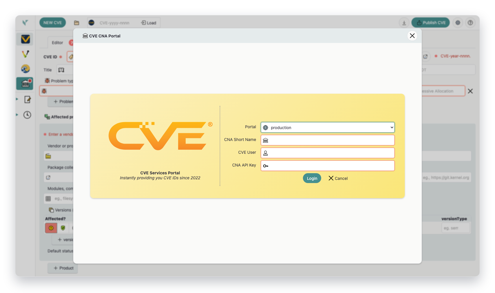
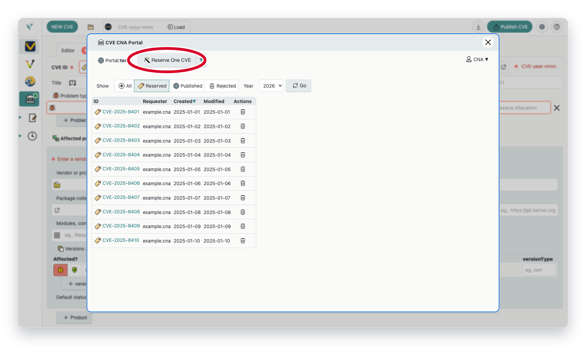
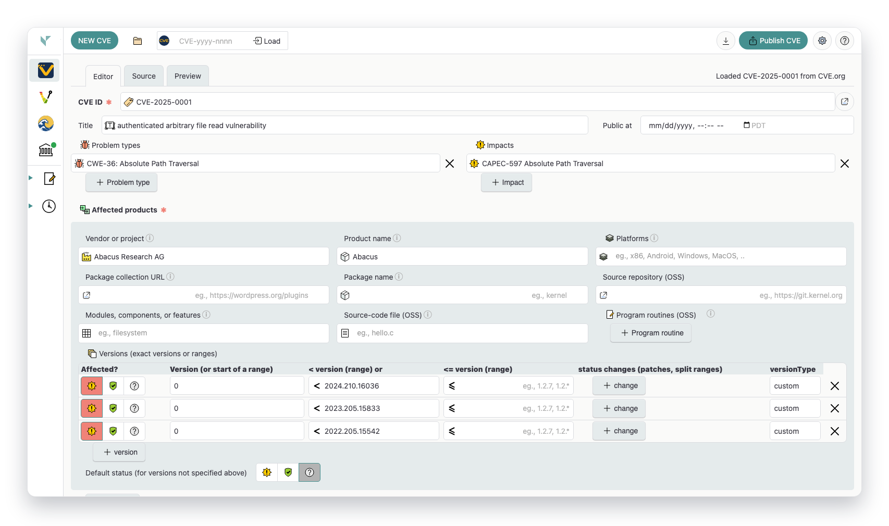
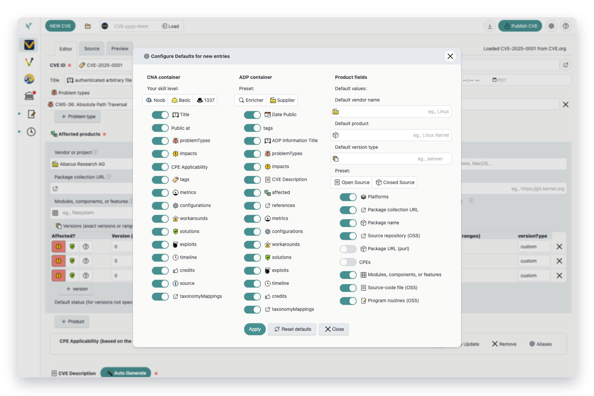
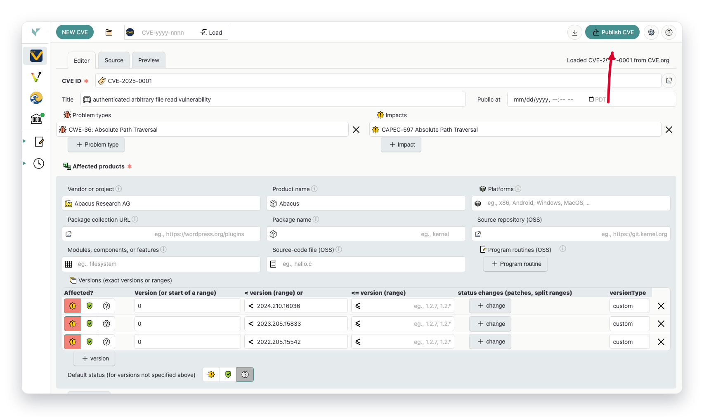
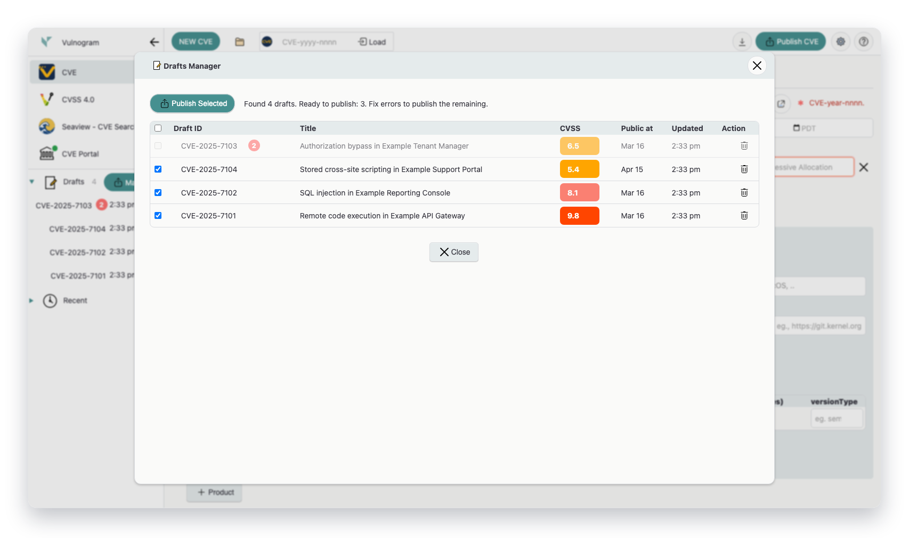
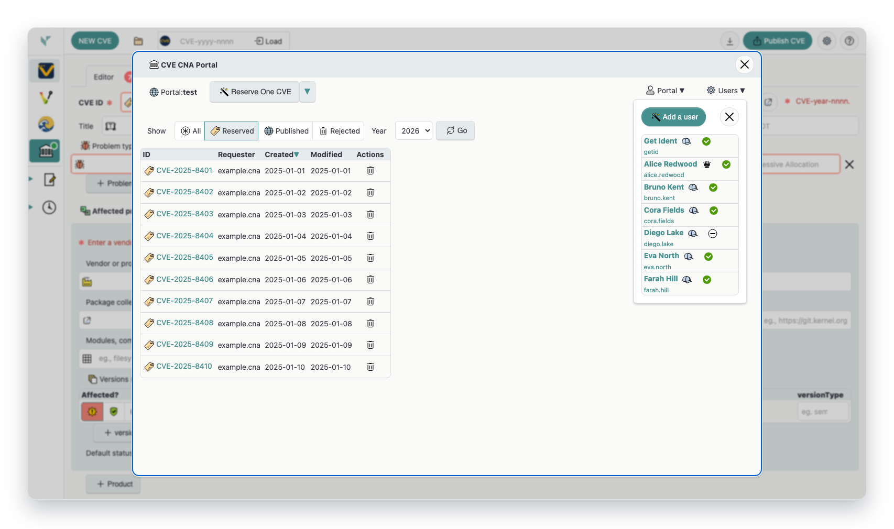
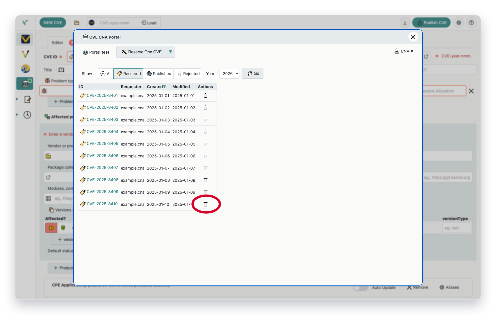
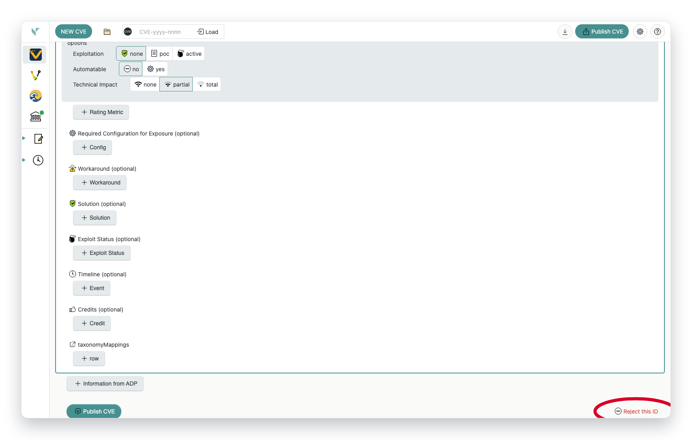

# Using Vulnogram with CVE Services

<link rel="stylesheet" href="https://vulnogram.org/css/min.css" />
<link rel="stylesheet" href="https://vulnogram.org/css/vg-icons.css" />

*Vulnogram - Reserve, Manage, Publish CVEs.*

## 1. Access Vulnogram

Open [Vulnogram.org](https://www.vulnogram.org) for a quick start. The instance on [Vulnogram.org](https://www.vulnogram.org) enables CNAs to use the browser to draft, manage, and publish CVE records. To enable multiple CNA team members to collaborate on drafts in a cental place, download and set up Vulnogram in [Team server mode](https://github.com/Vulnogram/Vulnogram?tab=readme-ov-file#vulnogram-team-deployment).

*Access Vulnogram at [https://www.vulnogram.org](https://www.vulnogram.org).*

## 2. Login to CVE Services

Open the <b class="lbl bor vgi-org">CVE Portal</b> panel, select the target portal (`production`, `test`, `adp-test`, or local), and authenticate with your CNA short name, CVE user, and API key.

*CVE Services login form from the <b class="lbl bor vgi-org">CVE Portal</b> sidebar action.*

## 3. Reserve CVE IDs

After login, use <b class="lbl bor vgi-magic">Reserve One CVE</b> or the dropdown batch actions to reserve IDs for the current year, next year, or previous year. Use state/year filters to find reserved IDs.

*<b class="lbl bor vgi-org">CVE Portal</b> reserve controls with state and year filters.*

## 4. Enter CVE Record Details

Use the **Editor** tab to enter vulnerability details, affected products, references, and metrics. Switch between **Editor**, **Source**, and **Preview** tabs while drafting.

For repeated CNA or ADP work, open the **Configure Default Settings** dialog from the top-right settings button . It lets you simplify the form for new entries by choosing default set of fields to show and by setting default vendor, product, and version-type values, which helps reduce repetitive edits and keeps new records more consistent.

*Primary **Editor** form where record content is entered.*

*The settings dialog configures defaults for new entries.*

## 5. Publish to CVE Services

Use <b class="lbl bor vgi-export">Publish CVE</b> to submit the record to the currently selected portal. In test mode, publishing targets the CVE Services test environment.

*Top action bar with <b class="lbl bor vgi-export">Publish CVE</b> control.*

*<b class="lbl bor vgi-edit">Drafts Manager</b> with sample cached CVE entries ready for bulk publish.*

## 6. Manage Users and API Keys (Admin)

Organization administrators can open <b class="lbl bor vgi-cog">Users</b> in the portal view to add users, update profile and role attributes, disable accounts, and reset API secrets.

*Admin-oriented <b class="lbl bor vgi-cog">Users</b> management view in the <b class="lbl bor vgi-org">CVE Portal</b>.*

## 7. How to Reject a CVE ID

Use <b class="lbl bor vgi-del">Reject this CVE ID</b> and <b class="lbl bor vgi-no">Reject this ID</b> controls to retire unused IDs or withdraw published records. The two workflows below show where each reject action lives.

### a) Rejecting Unused or Unpublished CVEs

*Unused/unpublished IDs can be rejected directly from <b class="lbl bor vgi-del">Reject this CVE ID</b> in the CVE list action column.*

### b) Rejecting Published CVEs

*Published records are rejected from the editor footer <b class="lbl bor vgi-no">Reject this ID</b> link after loading the CVE.*
